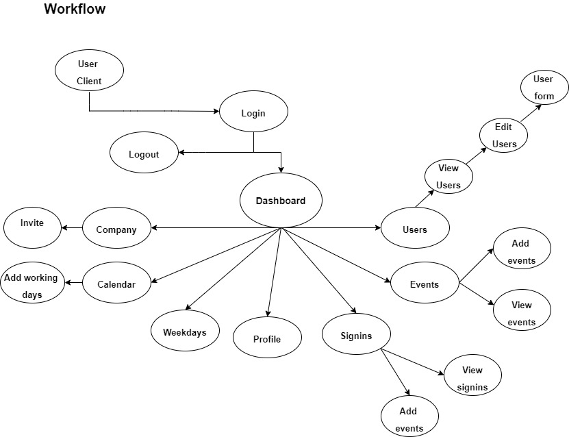
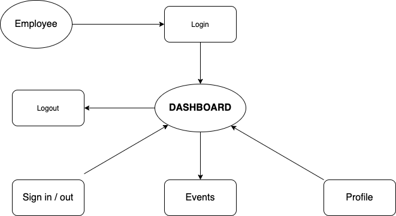
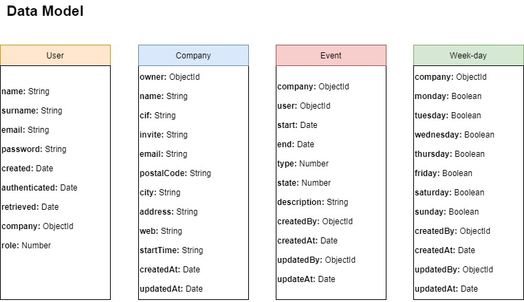
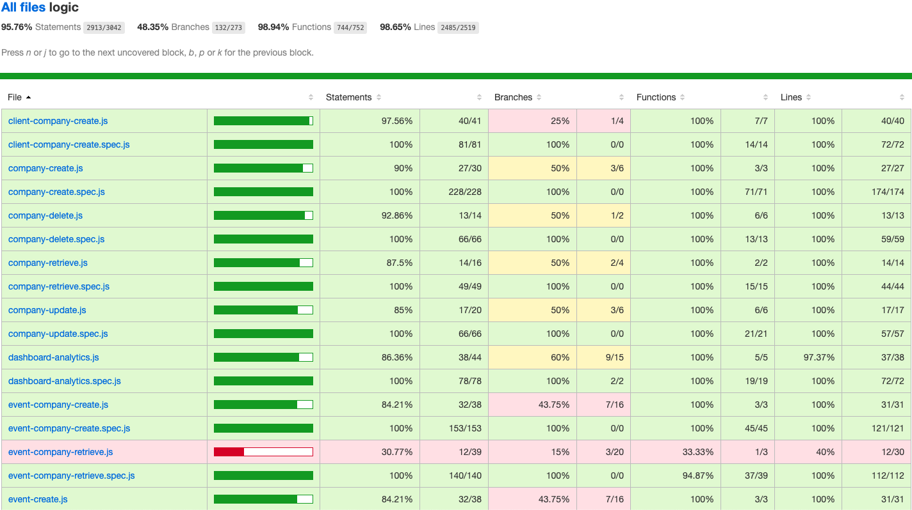
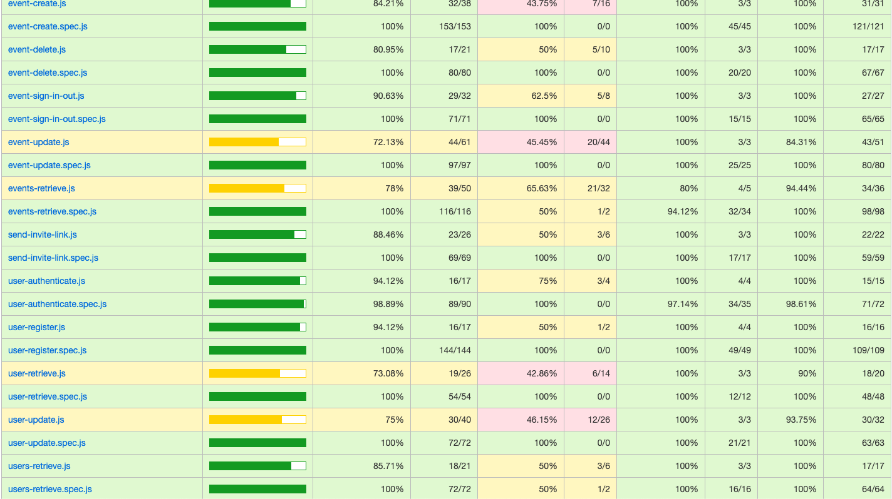
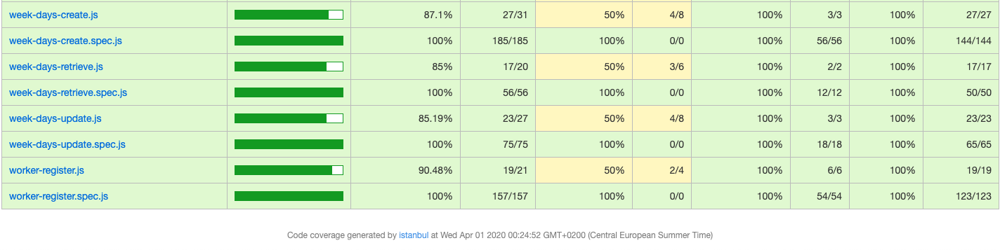
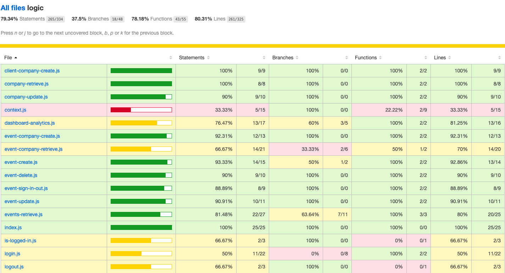
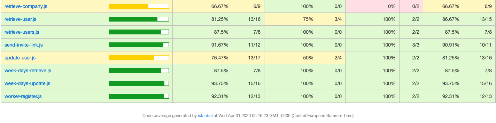

# Timekeeper 🕖
Timekeeper is a web application used for the control of working hours, readily available to any company of any size. It's a control system to manage working hours of employees as well as work calendars, holidays and the registration of working days.

## Functional description

An account is required to access the control panel. After creating an account, clients as well as workers will have access to their various menu options. The following functionalities are accessible in this application:

* View statistics like pending tasks, absences, total number of workers, etc
* View signings / working hours
* View events
* View users
* Week days
* Calendar UI
* Profile page
* Company profile

## Use case

* Case 1 (Client profile)  

* Case 2 (Employee profile)  

## Flow

## Blocks

## Data Model

## API code coverage 

### API

### APP

## [Timekeeper Trello](https://trello.com/b/A5Me1PKm/timekeeper)